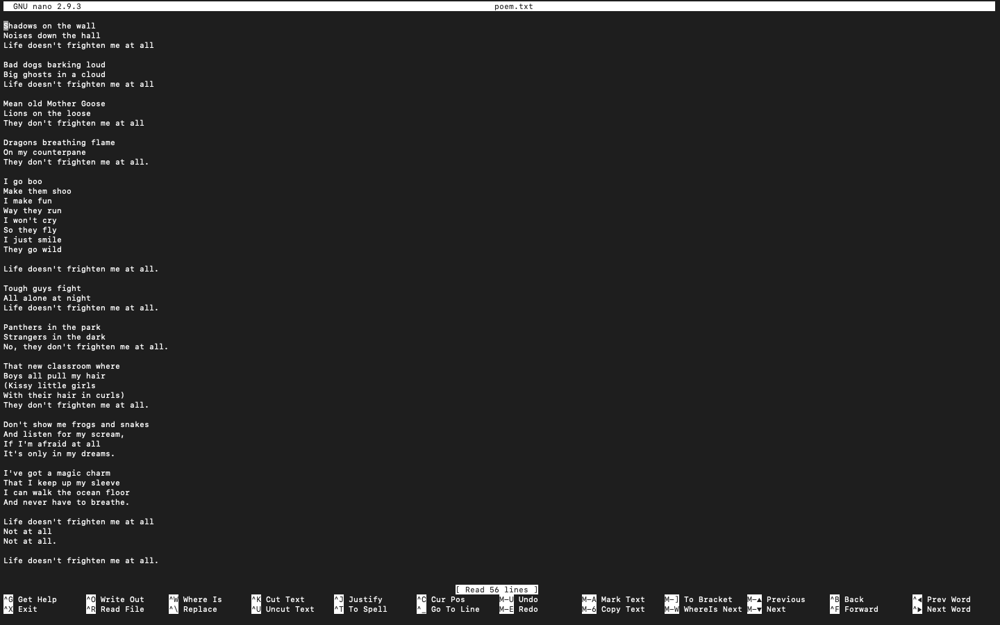
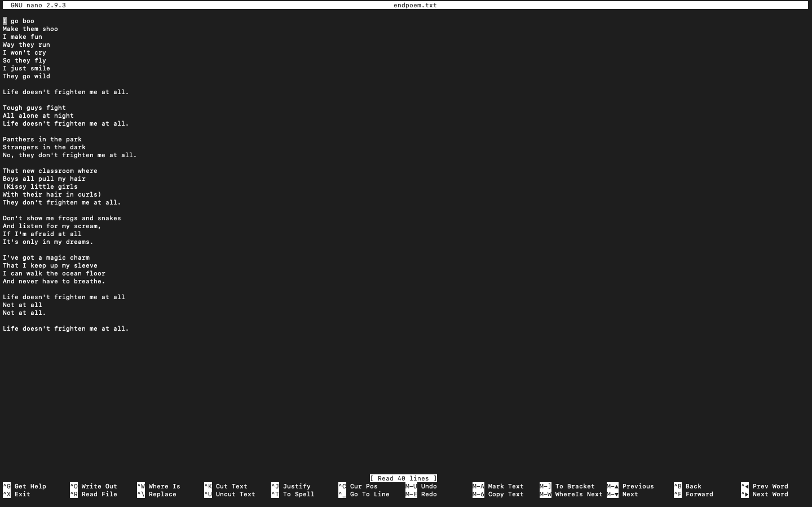
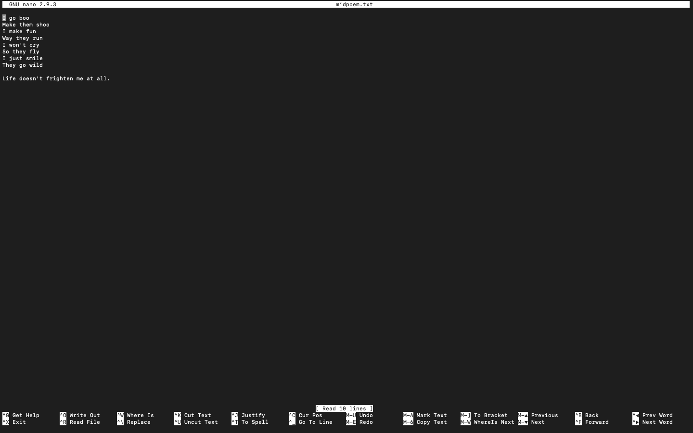
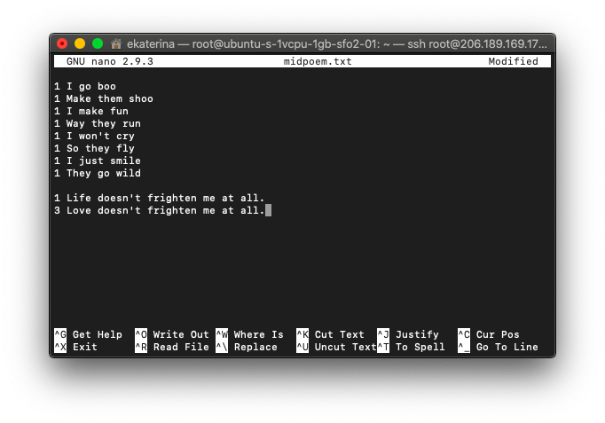
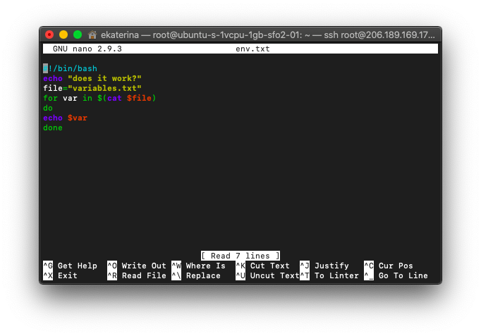

## Задание:
##### "Создать файл с повторяющимися строками, записать последние 40 строк во второй файл, 10 первых строк из второго файла записать в третий файл.  Выбрать во втором файле все строки, которые содержат 'Life' и заминить на слово 'Life' на 'Love' и дозаписать только первые три вхождения в третий файл. Оставить только уникальные строки в третьем файое с указанным количеством каждой."

## Решение:
##### Создаём первый файл с помощью команды `touch poem.txt`. 
##### Первый файл выглядит так:

##### Создаём второй файл `touch endpoem.txt` и с помощью команды `tail -n 40 poem.txt | cat > endpoem.txt` записываем последние 40 строк из первого файла во второй. 
##### Второй файл выглядит так:

##### Создаём третий файл `touch midpoem.txt` и с помощью команды `head -n 10 endpoem.txt | cat > midpoem.txt` записываем последние 10 строк из второго файла во третий. 
##### Третий файл выглядит так:

##### Следующую часть задания выполняем с помощью команды `sed -r 's/Life/Love/g' endpoem.txt | grep 'Love' | head -n 3 | cat >> midpoem.txt`. Получаем:

##### Выполняем сортировку третьего файла с помошью команды `sort midpoem.txt | uniq -c | cat > midpoem.txt`. Получаем:

##ENV:

